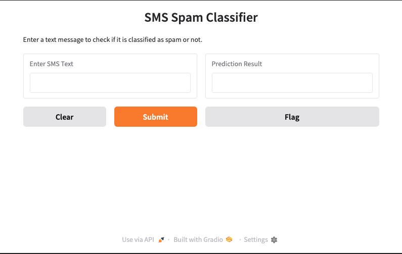

# SMS Spam Classification with SVC and Gradio



## Table of Contents
- [Overview](#overview)
- [Why This Matters: Business Applications 📊](#why-this-matters-business-applications-📊)
- [Features 🚀](#features-🚀)
- [Understanding the Two Notebooks 📖](#understanding-the-two-notebooks-📖)
  - [Notebook 1: SMS Text Classification (Traditional Model)](#notebook-1-sms-text-classification-traditional-model)
  - [Notebook 2: Gradio SMS Classification (Interactive Model)](#notebook-2-gradio-sms-classification-interactive-model)
  - [Comparison of Both Approaches](#comparison-of-both-approaches)
- [Project Implementation 💡](#project-implementation-💡)
  - [1. SMS Classification Model](#1-sms-classification-model)
  - [2. SMS Prediction Function](#2-sms-prediction-function)
  - [3. Gradio Web Application](#3-gradio-web-application)
- [Installation & Setup ⚙️](#installation-setup-⚙️)
- [Usage 📌](#usage-📌)
  - [Train the Model](#train-the-model)
  - [Run the Gradio App](#run-the-gradio-app)
- [Example Test Messages 📝](#example-test-messages-📝)
- [Dependencies 📦](#dependencies-📦)
- [Future Enhancements 🔮](#future-enhancements-🔮)
- [License 📜](#license-📜)

## Overview
This project is designed to **detect spam messages** using a machine learning model. By leveraging **Support Vector Classification (SVC)** and **TF-IDF vectorization**, we trained a model to classify SMS messages as either **spam or not spam (ham)**.

We further improved this solution by integrating it into a **Gradio-powered web application**, making it easy for users to classify messages in real-time.

## Why This Matters: Business Applications 📊
Spam detection is a crucial problem in modern communication systems. Businesses and individuals benefit in several ways:

| **Business Sector** | **Use Case** |
|-----------------|---------------------------|
| 📩 **Email Providers** | Automatically filtering spam emails to improve inbox experience. |
| 📱 **Telecom Companies** | Blocking fraudulent SMS messages to protect users. |
| 🏦 **Banking & Finance** | Identifying phishing scams sent via SMS. |
| 🛍️ **E-commerce** | Preventing spam promotions from affecting customer engagement. |
| 🏥 **Healthcare** | Filtering spam messages in patient communications. |

## Features 🚀
- **Spam Detection:** Classifies messages as spam or ham.
- **Machine Learning Model:** Uses **Support Vector Classification (SVC)**.
- **Text Preprocessing:** Converts SMS text into numerical features with **TF-IDF vectorization**.
- **Interactive Web App:** Provides real-time classification with **Gradio**.
- **Scalable & Adaptable:** The model can be retrained for custom datasets.

## Understanding the Two Notebooks 📖
This repository contains **two key notebooks**, each serving a different purpose.

### **Notebook 1: SMS Text Classification (Traditional Model)**
📌 **Purpose:**
- Loads the SMS dataset.
- Preprocesses text messages.
- Trains a **Linear Support Vector Classifier (SVC)** model.
- Evaluates model performance.

### **Notebook 2: Gradio SMS Classification (Interactive Model)**
📌 **Purpose:**
- Uses the trained model from Notebook 1.
- Implements a **Gradio-powered web interface**.
- Allows users to input messages and classify them **in real-time**.

### **Comparison of Both Approaches**
| **Feature** | **Traditional Model (Notebook 1)** | **Gradio Model (Notebook 2)** |
|------------|--------------------------------|--------------------------------|
| **Training & Testing** | Trains an SVC model on SMS data | Uses pre-trained model for classification |
| **Evaluation** | Computes accuracy & metrics | Not needed (already trained) |
| **User Interaction** | No user interaction | Users can test SMS messages via UI |
| **Deployment** | Not deployed | Live web app with Gradio |

**✅ Conclusion:** The **Gradio model enhances** the traditional model by providing an **easy-to-use interface**, making it accessible to non-technical users.

## Project Implementation 💡
### **1. SMS Classification Model**
- Loads and preprocesses `SMSSpamCollection.csv`.
- Sets up **features** (`text_message`) and **target** (`label`).
- Trains a **TF-IDF + Linear SVC** model.

### **2. SMS Prediction Function**
- Uses the trained model to classify messages.
- Returns **"spam" or "not spam"**.

### **3. Gradio Web Application**
- Creates an interactive web app with `gr.Interface()`.
- Allows real-time SMS classification.

## Installation & Setup ⚙️
```bash
pip install -r requirements.txt
```

## Usage 📌
### **Train the Model**
```bash
python train_model.py
```

### **Run the Gradio App**
```bash
python app.py
```

## Example Test Messages 📝
| **Test Message** | **Expected Output** |
|-----------------|------------------|
| "You won $5000!" | Spam |
| "Meeting at 5 PM?" | Not Spam |
| "Claim your free prize now!" | Spam |

## Dependencies 📦
- **Python 3.x**
- **scikit-learn**
- **pandas**
- **numpy**
- **Gradio**

## Future Enhancements 🔮
- **Train on larger datasets** for better accuracy.
- **Experiment with deep learning models**.
- **Deploy as a cloud-hosted web service**.

## License 📜
This project is licensed under the **MIT License**.